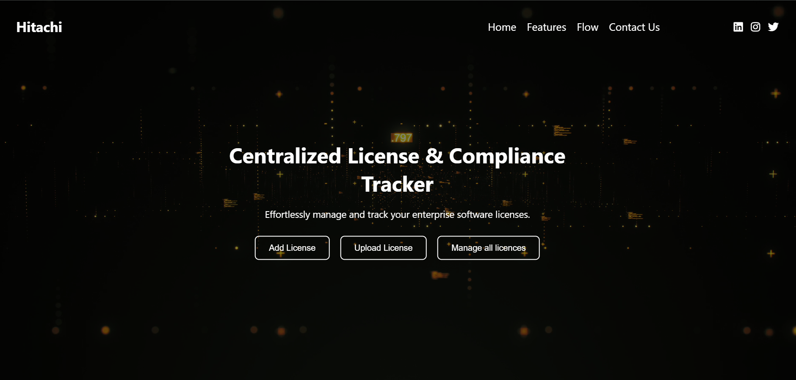
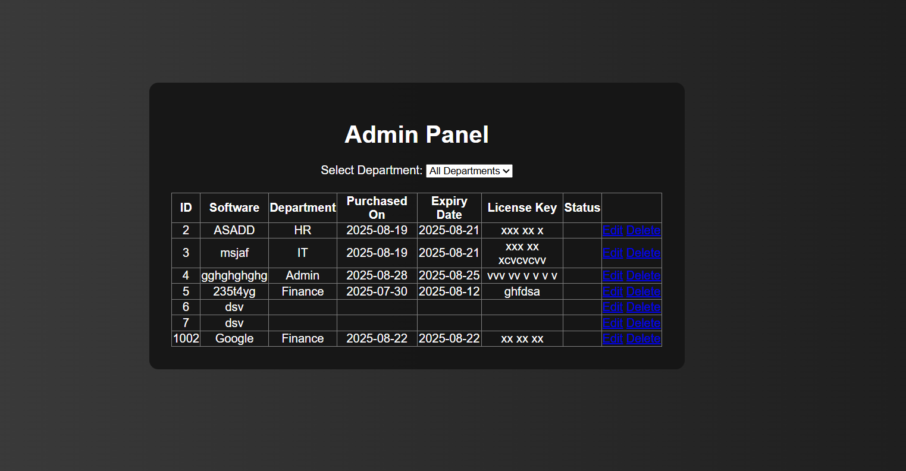
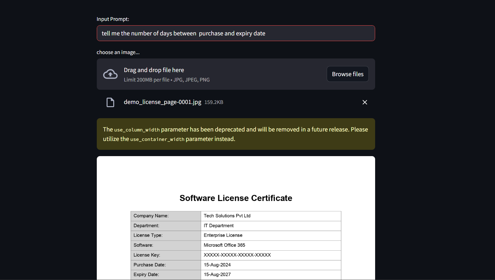
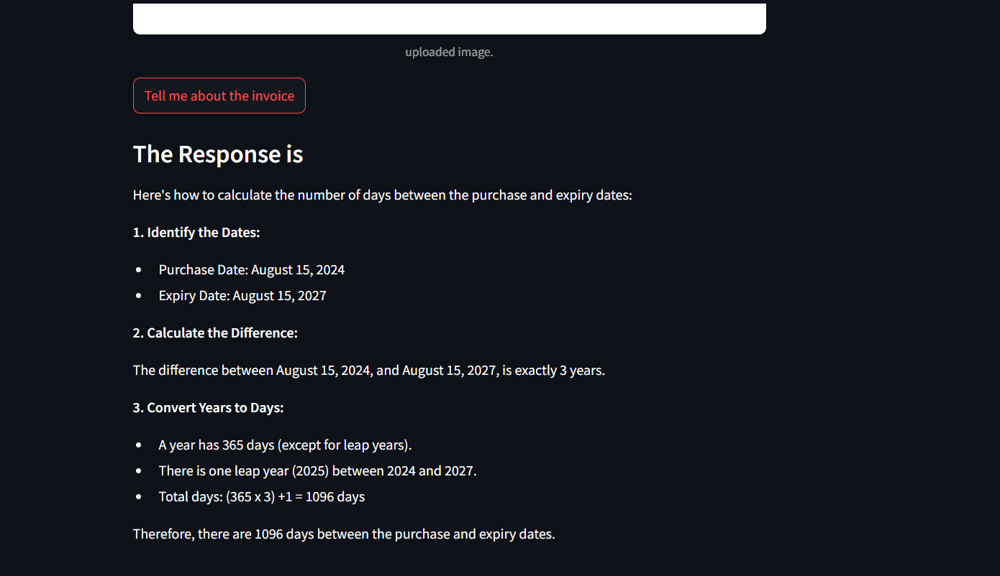
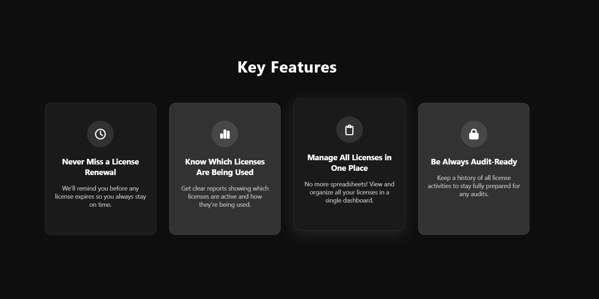
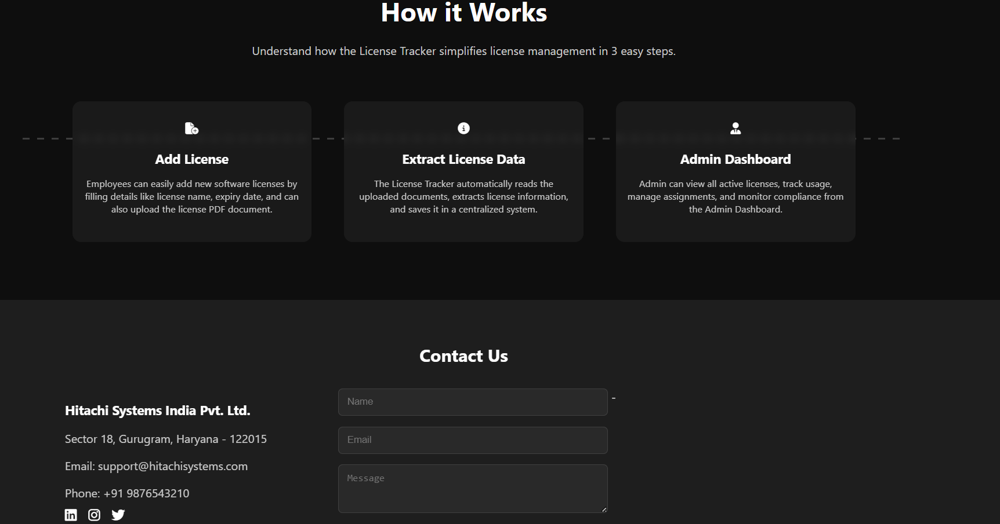

#  Centralised License Tracker (AI Powered)

Centralised License Tracker is a web-based application built using .NET and Python that allows organizations to manage licenses of multiple departments efficiently.  
The system includes AI-powered document understanding using the Gemini API, enabling users to upload license files and ask questions about them using natural language prompts.

---

##  Key Features

### 📄 License Management
- Add and update license records
- Centralized dashboard view
- Search and filter functionality

###  AI-Powered Document Q&A
- Upload license documents (PDF)
- AI extracts and understands content
- Ask questions in natural language
- Gemini API generates contextual answers

---

### Backend
- ASP.NET (.NET)
- C#
- REST API
- SQL Server

### AI Module
- Python
- Google Gemini API
- Streamlit
- Document parsing
- Prompt-based Q&A

### Frontend
- HTML
- CSS

 ## Project Screenshots

 - HomePage of License Tracker
   
   

  

- Admin DashBoard (here the admin can see all the licenses and can filter according to the departments)

 

  

- AI Prompt Example(User can ask question about any license by uploading the file)

   

  

- AI Response (This image is showcasing how the the AI Responds)

  

  

- Key Features section of License Tracker
  
   

  

- How it Works Section

   

  

##  Future Improvements

- Role-based authentication
- AI-based license expiry auto-detection
- Email reminders
- Cloud deployment (Azure/AWS)
- Admin analytics dashboard

  ##  Author

Mayank Patwal  
B.Tech Computer Science  
Intern @ Hitachi Systems India Pvt Ltd 

  

